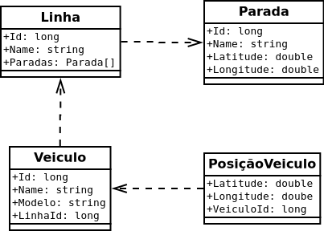

# Teste Back-end

Neste teste serão avaliados seus conhecimentos e a metodologia aplicada no desenvolvimento do back-end de uma aplicação.

## O Desafio

O desafio é criar um servidor que provê uma API com o objetivo de fornecer informações sobre o transporte público da cidade de São Paulo, similar a [API **Olho Vivo**](api.md).

## Requisitos

Esses requisitos são obrigatórios e devem ser desenvolvidos para a entrega do teste

### CRUD

Implementar as operações de **criação (POST)**, **consulta (GET)** (Por Id e GetAll), **atualização (PUT)** e **exclusão (DELETE)** de todas as entidades do seguinte diagrama:

### Métodos

Após implementar o CRUD para as entidades, implemente os seguintes métodos:

* `Linhas por Parada`: Recebe o identificador de uma parada e retorna as linhas associadas a parada informada

* `Veiculos por Linha`: Recebe o identificador de uma linha e retorna os veículos associados a linha informada

## O que é permitido

* C# (.NET, .NET Core, etc)

* Java (Spring, etc)

* PHP (Laravel, etc)

* Node (Adonis, Express, etc)

* Python (Django)

* PostgreSQL, MySQL, Oracle, etc

* Mapeamento objeto-relacional (ORM)

* Qualquer tecnologia complementar as citadas anteriormente são permitidas desde que seu uso seja justificável

## O que não é permitido

* Bancos de Dados **não relacionais**.
  
* Utilizar bibliotecas ou códigos de terceiros que implementem algum dos requisitos.

## Recomendações

* **Linter**: Desenvolva o projeto utilizando algum padrão de formatação de código.

* **Typescript**: O Typescript é recomendado para aqueles que vão utilizar tecnologias Javascript.

## Extras

Aqui são listados algumas sugestões para você que quer ir além do desafio inicial. Lembrando que você não precisa se limitar a essas sugestões, se tiver pensado em outra funcionalidade que considera relevante ao escopo da aplicação fique à vontade para implementá-la.

* `Paradas por Posição`: Implementar um método que recebe uma posição (lat, long) como parâmetro e retorna as paradas mais proximas a posição informada.

* **DDD**: Implementar a aplicação baseada nos princípios do Domain-driven design (DDD)

* **Documentação**: Gerar a documentação da API de forma automatizada, utilizando o `swagger` ou equivalentes

* **Containerização**: Realizar a conteinerização da aplicação utilizando Docker
