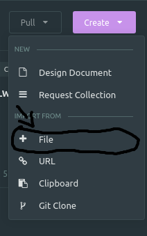
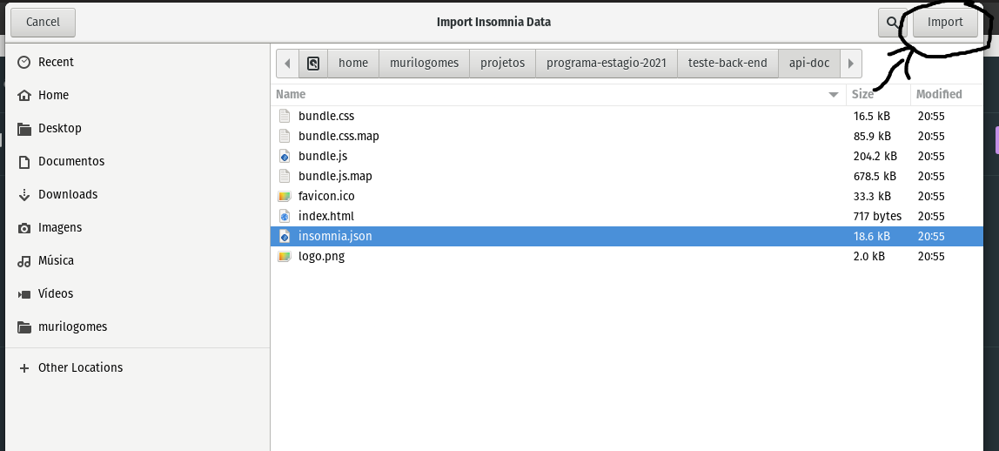

# Teste Back-End

Para rodar esse projeto, com o Docker e o docker-compose instalado em sua máquina, execute

```
$ sudo docker-compose up -d --build
```

## Documentação

### Abrindo as requisições no insomnia

Com o insomnia instalado na sua máquina, clique em create e depois em import from file



E selecione o arquivo [insomnia.json](./api-doc/insomnia.json) encontrado na pasta [api-doc](./api-doc)



Com isso, o insomnia vai abrir a coleção com todas as requisições

### Abrindo a documentação no browser

Entre na pasta [api-doc](./api-doc) e execute o comando

```
npx serve
```

Abra o browser no localhost:5000 

**Obs:** A documentação feita no insomnia para o browser não é muito bem detalhada então é recomendado importar as requisições direto no insomnia.